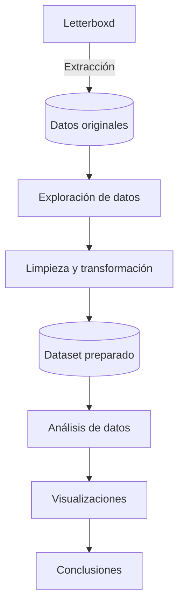

```mermaid
flowchart TD
    A[Letterboxd] 
    A -->|Extracción| B[(Datos originales)]

    B --> C[Exploración de datos]

    C --> D[Limpieza y transformación]

    D --> E[(Dataset preparado)]

    E --> F[Análisis de datos]

    F --> G[Visualizaciones]

    G --> H[Conclusiones]

```