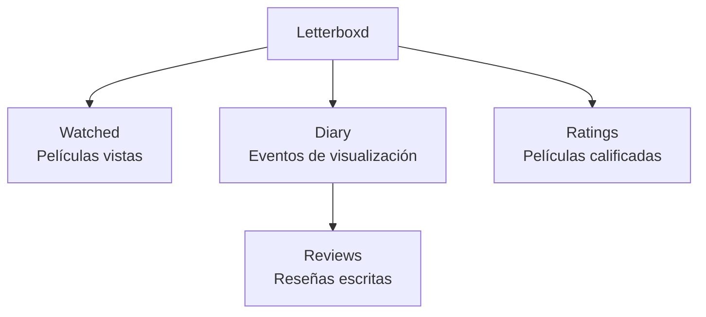

# Fase 5 — Analizar la estructura de los datos

El objetivo de esta fase es comprender cómo están organizados los datasets exportados desde Letterboxd, identificar qué representa cada columna, determinar el nivel de granularidad de cada archivo y realizar una primera validación de su calidad.

---

# Dataset: `ratings.csv`

## 1. Descripción general

Este dataset contiene las películas que han recibido una valoración por parte del usuario en Letterboxd.

Cada registro contiene información básica de la película, la fecha en que se registró la valoración y la puntuación asignada.

## 2. Columnas

| Columna          | Tipo original | Descripción                                    |
| ---------------- | ------------- | ---------------------------------------------- |
| `Date`           | `str`         | Fecha en que se registró la valoración         |
| `Name`           | `str`         | Nombre de la película                          |
| `Year`           | `int`         | Año de estreno                                 |
| `Letterboxd URI` | `str`         | Identificador/URL de la película en Letterboxd |
| `Rating`         | `float`       | Puntuación asignada por el usuario             |

## 3. Tipos de datos originales

* `Date` es texto.
* `Name` y `Letterboxd URI` son texto.
* `Year` se almacena como entero.
* `Rating` se almacena como decimal.

## 4. Validación de calidad

### Rating

Los valores posibles encontrados son:

`0.5, 1.0, 1.5, 2.0, 2.5, 3.0, 3.5, 4.0, 4.5, 5.0`

Esto confirma que las valoraciones utilizan una escala de **0.5 a 5.0**, en incrementos de **0.5**.

### Duplicados

* No existen registros duplicados completos.
* No se identifican combinaciones repetidas de `Name + Year`.

### Fechas

* No existen fechas nulas.
* Las fechas se encuentran dentro de un rango válido.
* No se observan fechas futuras incorrectas.
* El período registrado va desde **2023-10-28 hasta 2026-08-22**.

## 5. ¿Qué representa cada fila?

Cada fila representa **una valoración registrada para una película**.

La película puede identificarse mediante su nombre, año de estreno y `Letterboxd URI`, mientras que `Date` indica cuándo se registró la valoración y `Rating` contiene la puntuación otorgada.

Por lo tanto, el grano del dataset es: **Una valoración por película registrada por el usuario.**

# Dataset: `diary.csv`

## 1. Descripción general

Este dataset contiene el historial de visualizaciones registradas en el diario de Letterboxd. 

## 2. Columnas

| Columna          | Tipo original  | Descripción                            |
| ---------------- | -------------- | -------------------------------------- |
| `Date`           | `str`          | Fecha asociada al registro             |
| `Name`           | `str`          | Nombre de la película                  |
| `Year`           | `int`          | Año de estreno                         |
| `Letterboxd URI` | `str`          | Identificador/URL de la película       |
| `Rating`         | `float`        | Puntuación, cuando existe              |
| `Rewatch`        | `str` / `bool` | Indica si corresponde a un revisionado |
| `Tags`           | `str`          | Etiquetas asociadas al registro        |
| `Watched Date`   | `str` / fecha  | Fecha de visualización                 |

## 3. Tipos de datos originales

* `Date` y `Watched Date` deben validarse y, cuando corresponda, convertirse a tipos de fecha.
* `Name`, `Letterboxd URI` y `Tags` son texto.
* `Year` es entero.
* `Rating` es decimal.
* `Rewatch` requiere validación para determinar su representación exacta en el archivo.

## 4. Validación de calidad

### Grano de observación

A diferencia de `ratings.csv`, su objetivo principal no es representar una valoración, sino **registrar eventos de visualización**. Una misma película puede aparecer más de una vez si fue vista nuevamente y cada registro puede contener información asociada a ese evento.

Por ejemplo, si una película fue vista dos veces en fechas diferentes, puede existir:

```text
Película A | 2025-05-10
Película A | 2026-02-15
```

### Duplicados

Se debe comprobar:

* duplicados completos;
* repeticiones de `Name`;
* posibles repeticiones de `Name + Watched Date`.

Estas filas no deben considerarse automáticamente duplicados, porque representan dos eventos diferentes. La repetición de un título por sí sola **no constituye necesariamente un error**. 

## 5. ¿Qué representa cada fila?

Cada fila representa: **Un evento de visualización de una película registrado en el diario de Letterboxd.**

La fecha de visualización, `Rewatch`, `Tags` y `Rating` aportan información adicional sobre ese evento.

# Dataset: `watched.csv`

## 1. Descripción general

Este dataset contiene las películas que el usuario ha marcado como vistas en Letterboxd. A diferencia de `diary.csv`, este archivo debe interpretarse como un registro de películas marcadas como vistas y no necesariamente como un historial detallado de cada visualización.

## 2. Columnas

| Columna          | Tipo original  | Descripción                                           |
| ---------------- | -------------- | ----------------------------------------------------- |
| `Date`           | `str`          | Fecha asociada al registro, según la exportación      |
| `Name`           | `str`          | Nombre de la película                                 |
| `Year`           | `int`          | Año de estreno                                        |
| `Letterboxd URI` | `str`          | Identificador/URL de la película                      |
| `Watched Date`   | `str` / fecha  | Fecha asociada a la visualización, si está disponible |
| `Rewatch`        | `str` / `bool` | Indicador de revisionado, si está disponible          |
| `Tags`           | `str`          | Etiquetas asociadas                                   |

## 3. Tipos de datos originales

* `Date` y `Watched Date` deben validarse y convertirse a fecha cuando corresponda.
* `Name`, `Letterboxd URI` y `Tags` son texto.
* `Year` es entero.
* `Rewatch` debe validarse según el formato real del archivo.

## 4. Validación de calidad

En este dataset es necesario comprobar específicamente su nivel de granularidad.

Debemos determinar:

* si cada película aparece una sola vez;
* si existen películas repetidas;
* si existe una relación directa entre este archivo y los registros de `diary.csv`.

Por tanto, **no debemos asumir todavía que `watched.csv` representa una única fila por película hasta comprobarlo con los datos**.

## 5. ¿Qué representa cada fila?

La interpretación inicial es: **Una película marcada como vista por el usuario.**

# Dataset: `reviews.csv`

## 1. Descripción general

Este dataset contiene las reseñas escritas por el usuario sobre películas registradas en Letterboxd.

## 2. Columnas

| Columna          | Tipo original  | Descripción                      |
| ---------------- | -------------- | -------------------------------- |
| `Date`           | `str`          | Fecha del registro               |
| `Name`           | `str`          | Nombre de la película            |
| `Year`           | `int`          | Año de estreno                   |
| `Letterboxd URI` | `str`          | Identificador/URL de la película |
| `Rating`         | `float`        | Puntuación, si existe            |
| `Rewatch`        | `str` / `bool` | Indicador de revisionado         |
| `Tags`           | `str`          | Etiquetas asociadas              |
| `Watched Date`   | `str` / fecha  | Fecha de visualización           |
| `Review`         | `str`          | Texto de la reseña               |

## 3. Tipos de datos originales

* `Date` y `Watched Date` deben validarse y convertirse a fecha.
* `Name`, `Letterboxd URI` y `Tags` son texto.
* `Year` es entero.
* `Rating` es decimal.
* `Review` es texto libre y puede tener una longitud variable.

## 4. Validación de calidad

### Review

La columna `Review` requiere una validación específica.

Debemos comprobar:

* cantidad de valores nulos;
* cantidad de reseñas vacías;
* longitud de las reseñas;
* valores extremadamente cortos o largos;
* caracteres especiales;
* posibles problemas de formato.

Estas comprobaciones serán especialmente importantes si posteriormente queremos realizar un análisis de texto.

### Duplicados

También debemos comprobar si existen:

* duplicados completos;
* películas repetidas;
* combinaciones repetidas de `Name + Date`;
* combinaciones repetidas de `Name + Watched Date`.

Una película repetida no implica necesariamente un error, ya que puede existir más de un registro asociado a ella.

## 5. ¿Qué representa cada fila?

Cada fila representa: **Una reseña registrada por el usuario sobre una película.**

---

# Resumen de la estructura

Los cuatro datasets representan diferentes actividades dentro del historial de Letterboxd:

| Dataset       | Grano principal              | Propósito                                                    |
| ------------- | ---------------------------- | ------------------------------------------------------------ |
| `ratings.csv` | Valoración                   | Registrar películas calificadas y sus puntuaciones           |
| `diary.csv`   | Evento de visualización      | Registrar cuándo se vieron películas                         |
| `watched.csv` | Película marcada como vista* | Registrar películas que forman parte del historial de vistas |
| `reviews.csv` | Reseña                       | Registrar reseñas escritas sobre películas                   |

* El grano exacto de `watched.csv` debe confirmarse mediante la exploración de los datos.

## Relación conceptual entre los datasets

Los datasets no representan exactamente lo mismo. Cada uno describe una actividad diferente:



Por esta razón, antes de combinar los datasets será necesario identificar las **claves o identificadores comunes**, especialmente `Letterboxd URI`, `Name` y `Year`, y determinar qué relaciones existen realmente entre ellos.

## Conclusión 

La exploración inicial muestra que los datasets tienen **diferentes niveles de granularidad**. Esta diferencia es fundamental para evitar errores durante el análisis.

En particular:

* `ratings.csv` se centra en las valoraciones.
* `diary.csv` se centra en los eventos de visualización.
* `watched.csv` se centra en las películas marcadas como vistas.
* `reviews.csv` se centra en las reseñas escritas.

